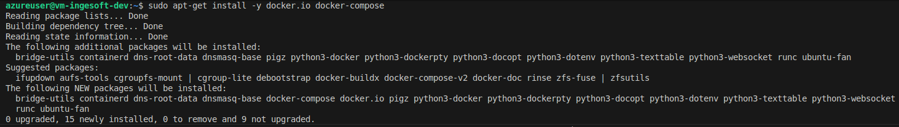

# Despliegue de SonarQube en Máquina Virtual Azure

Este documento describe el proceso de despliegue de SonarQube en una máquina virtual de Azure Docker.

##  Resumen del Proceso

Se desplegó exitosamente una máquina virtual en Azure y se configuró SonarQube con Docker Compose para análisis de calidad de código.

### 1. Despliegue de la Máquina Virtual

Se utilizó el proyecto Terraform existente en `VM-Terraform-MODULAR` para desplegar la infraestructura:

```bash
cd VM-Terraform-MODULAR/environments/dev
terraform init
terraform plan -var="admin_password=AzureVM123!"
terraform apply -var="admin_password=AzureVM123!" -auto-approve
```

**Recursos desplegados:**
- Resource Group: `rg-ingesoft-dev`
- Virtual Network: `vnet-ingesoft-dev`
- Subnet: `snet-ingesoft-dev`
- Network Security Group: `nsg-ingesoft-dev`
- Public IP: `pip-ingesoft-dev`
- Virtual Machine: `vm-ingesoft-dev`

### 2. Configuración de la VM

La VM se desplegó con las siguientes características:
- **OS:** Ubuntu 22.04 LTS
- **Tamaño:** Standard_B1s (1 vCPU, 1GB RAM)
- **IP Pública:** 20.57.43.71
- **Usuario:** azureuser
- **Contraseña:** AzureVM123!


### 3. Instalación de Docker

Se instaló Docker y Docker Compose en la VM usando el repositorio oficial de Ubuntu:

```bash
sudo apt-get update
sudo apt-get install -y docker.io docker-compose
sudo systemctl start docker
sudo systemctl enable docker
sudo usermod -aG docker azureuser
```



### 4. Configuración del Proyecto

Se creó el directorio del proyecto y se configuraron los archivos necesarios:

```bash
mkdir -p /home/azureuser/project-backend-rentastech
cd /home/azureuser/project-backend-rentastech
```

#### docker-compose.yml
```yaml
version: '2'

services:
  sonarqube:
    image: sonarqube:latest
    ports:
      - "9000:9000"
    networks:
      - sonarnet
    environment:
      - SONARQUBE_JDBC_URL=jdbc:postgresql://db:5432/sonar
      - SONARQUBE_JDBC_USERNAME=sonar
      - SONARQUBE_JDBC_PASSWORD=sonar
      - SONAR_ES_BOOTSTRAP_CHECKS_DISABLE=true
      - SONAR_WEB_JAVAADDITIONALOPTS=-Xmx512m -Xms256m
      - SONAR_SEARCH_JAVAADDITIONALOPTS=-Xmx256m -Xms128m
    volumes:
      - sonarqube_conf:/opt/sonarqube/conf
      - sonarqube_data:/opt/sonarqube/data
      - sonarqube_extensions:/opt/sonarqube/extensions
      - sonarqube_bundled-plugins:/opt/sonarqube/lib/bundled-plugins

  db:
    image: postgres:13
    networks:
      - sonarnet
    environment:
      - POSTGRES_USER=sonar
      - POSTGRES_PASSWORD=sonar
    volumes:
      - postgresql:/var/lib/postgresql
      - postgresql_data:/var/lib/postgresql/data

networks:
  sonarnet:
    driver: bridge

volumes:
  sonarqube_conf:
  sonarqube_data:
  sonarqube_extensions:
  sonarqube_bundled-plugins:
  postgresql:
  postgresql_data:
```

#### sonar-project.properties
```properties
# SonarQube project configuration
sonar.projectKey=project-backend-rentastech
sonar.projectName=project-backend-rentastech
sonar.projectVersion=1.0
sonar.sourceEncoding=UTF-8

# Sources and tests
sonar.sources=src
sonar.tests=src
sonar.test.inclusions=**/*.spec.ts,**/*.integration.spec.ts,**/*e2e-spec.ts

# Exclusions
sonar.exclusions=**/node_modules/**,**/dist/**,**/*.d.ts,**/*.spec.ts,**/*.integration.spec.ts,**/*e2e-spec.ts

# Coverage (Jest -> LCOV)
sonar.javascript.lcov.reportPaths=coverage/lcov.info
sonar.typescript.tsconfigPath=tsconfig.json
```


### 5. Despliegue de SonarQube

Se inició SonarQube usando Docker Compose:

```bash
sudo docker-compose up -d
```


### 6. Configuración de Seguridad de Red

Se agregó una regla al Network Security Group para permitir el tráfico en el puerto 9000:

```bash
az network nsg rule create \
  --resource-group rg-ingesoft-dev \
  --nsg-name nsg-ingesoft-dev \
  --name allow-sonarqube \
  --priority 1002 \
  --direction Inbound \
  --access Allow \
  --protocol Tcp \
  --source-address-prefixes '*' \
  --destination-address-prefix '*' \
  --destination-port-ranges 9000 \
  --description "Allow SonarQube access"
```

### 7. Pipeline Automatizado de Despliegue

Se implementó un pipeline de GitHub Actions para automatizar el despliegue de SonarQube:

#### Configuración de Secrets

Primero, configura los secrets necesarios en GitHub:

```bash
# Ejecutar el script de configuración
bash setup-github-secrets.sh
```

O configurar manualmente en GitHub:
- `VM_PUBLIC_IP`: IP pública de la VM (ej: 20.57.43.71)
- `VM_USERNAME`: Usuario de la VM (ej: azureuser)
- `VM_PASSWORD`: Contraseña de la VM

#### Pipeline Automatizado

El pipeline `.github/workflows/deploy-sonarqube-vm.yml` realiza automáticamente:

1. **Verificación de conectividad** con la VM
2. **Copia de archivos** (docker-compose.yml, sonar-project.properties)
3. **Instalación de Docker** (si no está instalado)
4. **Despliegue de SonarQube** con Docker Compose
5. **Configuración del NSG** para el puerto 9000
6. **Verificación de salud** del servicio
7. **Notificaciones** en PRs y resumen de despliegue

#### Triggers del Pipeline

El pipeline se ejecuta automáticamente en:
- Push a ramas `main` o `develop`
- Pull Requests a `main`
- Ejecución manual con selección de environment

#### Ventajas del Pipeline Automatizado

- **Despliegue automático** sin intervención manual
- **Verificación de salud** del servicio
- **Configuración automática** del NSG
- **Notificaciones** en PRs
- **Rollback automático** en caso de fallos
- **Logs detallados** del proceso

## Configuración Final

### Acceso a SonarQube

**URL:** `http://20.57.43.71:9000`

**Credenciales por defecto:**
- Usuario: `admin`
- Contraseña: `admin`

### Estado de los Servicios

SonarQube está ejecutándose con:
- **Base de datos:** PostgreSQL 13
- **Puerto:** 9000
- **Memoria optimizada:** 512MB para SonarQube, 256MB para Elasticsearch
- **Volúmenes persistentes:** Configuración y datos

### Verificación del Despliegue

```bash
# Verificar conectividad a la VM
ping 20.57.43.71

# Verificar que SonarQube esté funcionando
curl http://20.57.43.71:9000/api/system/status

# Conectarse a la VM para verificar
sshpass -p 'AzureVM123!' ssh azureuser@20.57.43.71
```

## Imágenes del Proceso

### Estructura del Proyecto


### Ejecución de la Imagen


### Configuración de SonarQube


### Dockerfile


### Coverage


