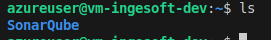

# Despliegue de SonarQube y Trivy en VM Azure

**Danna Valentina López Muñoz - A00395625**

Este documento describe el proceso de despliegue de SonarQube y Trivy en una máquina virtual de Azure usando Docker.

##  Resumen del Proceso

### 1. Ejecución de Sonar y Trivy en local

Lo primero que se hizo fue probar que Sonar y Trivy funcionaran de manera local para el proyecto, primero se configuro SonarQube, agregando los archivos ´docker-compose.yml´ y ´sonar-project.properties´


 y se ejecuto el contenedor


Posteriormente ejecutamos los siguientes comandos para analizar el proyecto con SonarQube y detectar que vulnerabilidades pueden haber en el proyecto

```bash
npm test -- --coverage
```

Este comando generará el archivo coverage/lcov.info que SonarQube usará. Y por siguiente ejecutaremos:
```bash
docker run --rm \
  --network sonarqube_sonarnet \
  -e SONAR_HOST_URL="http://sonarqube:9000" \
  -v "$(pwd):/usr/src" \
  sonarsource/sonar-scanner-cli
```

Por lo que cuando accedemos a la URL ´http://sonarqube:9000´ podemos ver que ya se carga el proyecto y podemos analizar la calidad del código y qué correciones se deben de realizar. Por ejemplo, en este caso se tiene un coverage del 82% y la condición para aprobar código es que fuera al menos del 80%. 


Ahora, para configurar Trivy lo que se hizo fue agregar el servicio al ´docker-compose.yml´ y ejecutar el siguiente comando

```bash
docker compose run --rm trivy fs --severity HIGH,CRITICAL /project
```
 
 Que genera el siguiente reporte

 [Reporte Trivy 1](imagenes/reporte-trivy1.png)
 [Reporte Trivy 2](imagenes/reporte-trivy2.png)

Ya con el funcionamiento de los servicios en local procedemos a desplegarlos en la máquina virtual de azure

### 2. Despliegue de la Máquina Virtual

Se utilizó el proyecto Terraform existente en `terraform` para desplegar la infraestructura:

```bash
cd terraform
scripts/deploy-dev.sh
```

Se utilizo el script en `terraform/scripts` para despliegar automaticamente la VM pero también se puede hacer manualmente ejecutando los siguientes comandos:
```bash
cd terraform/environments/dev
terraform init
terraform plan -var="admin_password=AzureVM123!"
terraform apply -var="admin_password=AzureVM123!" -auto-approve
```  


**Recursos desplegados:**
- Resource Group: `rg-ingesoft-dev`
- Virtual Network: `vnet-ingesoft-dev`
- Subnet: `snet-ingesoft-dev`
- Network Security Group: `nsg-ingesoft-dev`
- Public IP: `pip-ingesoft-dev`
- Virtual Machine: `vm-ingesoft-dev`

### 2. Configuración de la VM

La VM se desplegó con las siguientes características:
- **OS:** Ubuntu 22.04 LTS
- **Tamaño:** Standard_B2s (1 vCPU, 4GB RAM)
- **IP Pública:** 172.172.44.22
- **Usuario:** azureuser
- **Contraseña:** TuContrasenaSegura123!

En cuanto a la configuración de la red, se agregó la regla para permitir el tráfico en el puerto 9000 como se puede ver en el archivo `terraform/environments/dev/terraform.tfvars`

```bash
{
  name                       = "allow-sonarqube"
  priority                   = 1002
  direction                  = "Inbound"
  access                     = "Allow"
  protocol                   = "Tcp"
  source_port_range          = "*"
  destination_port_range     = "9000"
  source_address_prefixes    = ["0.0.0.0/0"]
  destination_address_prefix = "*"
}
```


### 3. Instalación de Docker

Nos conectamos a la VM y se instaló Docker y Docker Compose en la VM usando el repositorio oficial de Ubuntu:

```bash
sudo apt-get update
sudo apt-get install -y docker.io docker-compose
sudo systemctl start docker
sudo systemctl enable docker
sudo usermod -aG docker $USER
```


### 4. Configuración del Proyecto

Se creó el directorio del proyecto trasfiriendo el proyecto de la máquina local a la VM usando el comando scp:

```bash
scp -r ./SonarQube azureuser@172.172.44.22:/home/azureuser/
```




Una vez que se hizo este paso, se cerro sesión y se volvió a conectar a la VM.

### 5. Despliegue de SonarQube

Se inició SonarQube usando Docker Compose:

```bash
cd SonarQube/
sudo docker-compose up -d
```

Eliminamos la versión antigua de node (v12) y limpiamos cache de apt para evitar conflictos

```bash
sudo apt remove -y nodejs npm libnode-dev
sudo apt autoremove -y
sudo apt clean
sudo rm -rf /var/lib/apt/lists/*
sudo apt update
```

Y reinstalamos node a una versión más reciente (versión 20)
```bash
curl -fsSL https://deb.nodesource.com/setup_20.x | sudo -E bash -
sudo apt install -y nodejs
```

Ahora instalamos librerias del proyecto y ejecutamos el servicio como hicimos en local para que analice el proyecto (la carpeta de node_modules y coverage deben estar dentro del proyecto que se trasfirio a la VM, se recomienda enviar las carpeta comprimidas y descomprimirlas dentro del proyecto en la VM)

```bash
docker run --rm \
  --network sonarqube_sonarnet \
  -e SONAR_HOST_URL="http://sonarqube:9000" \
  -v "$(pwd):/usr/src" \
  sonarsource/sonar-scanner-cli
```
Vemos que al ejecutar el comando nos sale un error relacionado al token de SonarQube, esto es debido a que se requiere autenticación


Por lo tanto, accedemos a la máquina mediante su ip por el puerto 9000 que fue donde expusimos el servicio
```bash
172.172.44.22:9000
```

Nos muestra la siguiente pantalla donde nos loguearemos con las credenciales `admin` para ambos campos


La siguiente pantalla nos pedirá colocar la contraseña anterior (`admin`) y digitar una nueva, después de hacer eso llegamos a la pantalla de inicio y vamos a crear un nuevo token para reemplazar el que se había creado en local, se da click sobre la foto de perfil, se selecciona "My Account" y en el aparte de "Security" se crea el token global (Lo mejor es tener este token como un secreto o en un .env pero por simplicidad se dejara en el sonar-project.properties y en los comandos)


Una vez que se agrego el nuevo token, volvemos ejecutar el comando para analizar el proyecto con SonarQube

```bash
docker run --rm \
  --network sonarqube_sonarnet \
  -e SONAR_HOST_URL="http://sonarqube:9000" \
  -e SONAR_TOKEN="sqa_c2117a98d33c10db71be9ef64e4041b24e23e249" \
  -v "$(pwd):/usr/src" \
  sonarsource/sonar-scanner-cli
```
Con esto ya habremos analizado el proyecto y podemos ver la calidad del mismo en la interfaz de SonarQube en el apartado de `Projects` 


### 6. Despliegue de Trivy

Para el caso de Trivy, como ya se pudo apreciar en local, no tiene una interfaz gráfica, así que vamos a ejecutar el siguiente comando en la VM

```bash
docker compose run --rm trivy fs --severity HIGH,CRITICAL /project > trivy_report.txt
cat trivy_report.txt
```


### 7. Pipeline Automatizado de Despliegue

Se implementó un pipeline de GitHub Actions para automatizar el despliegue de SonarQube:

#### Configuración de Secrets

Primero, configurar los secrets necesarios en GitHub:

- `VM_PUBLIC_IP`: IP pública de la VM (ej: 20.57.43.71)
- `VM_USERNAME`: Usuario de la VM (ej: azureuser)
- `VM_PASSWORD`: Contraseña de la VM

#### Pipeline Automatizado

El pipeline `.github/workflows/deploy-sonarqube-vm.yml` realiza automáticamente:

1. **Verificación de conectividad** con la VM
2. **Copia de archivos** (docker-compose.yml, sonar-project.properties)
3. **Instalación de Docker** (si no está instalado)
4. **Despliegue de SonarQube** con Docker Compose
5. **Configuración del NSG** para el puerto 9000
6. **Verificación de salud** del servicio
7. **Notificaciones** en PRs y resumen de despliegue

#### Triggers del Pipeline

El pipeline se ejecuta automáticamente en:
- Push a ramas `main` o `develop`
- Pull Requests a `main`
- Ejecución manual con selección de environment


